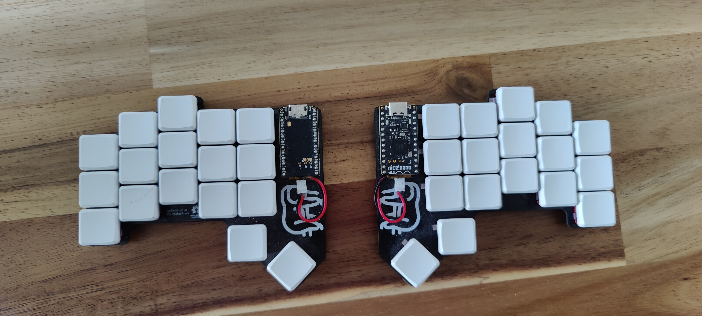
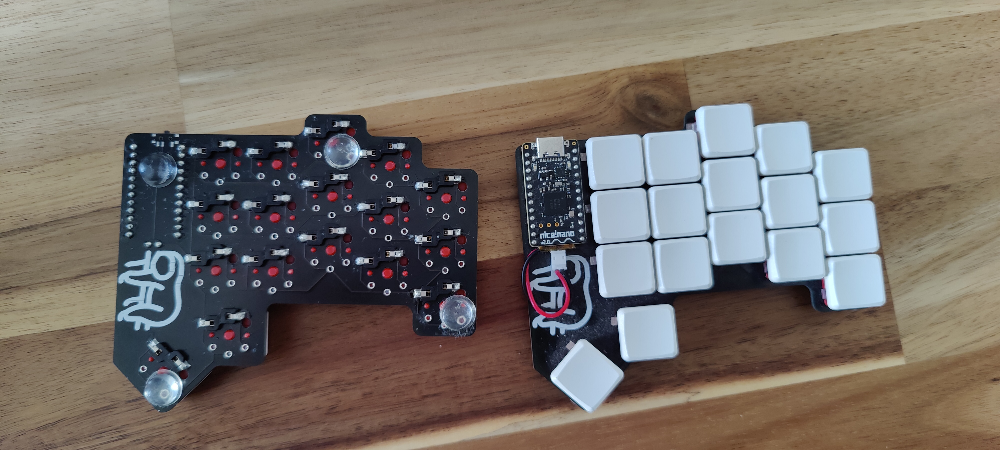

# LeBeDa
GERBER and kicad files are in [lbd](lbd) folder

Sloth on silkscreen from:
[Sloth icons created by Vitaly Gorbachev - Flaticon](https://www.flaticon.com/free-icons/sloth)

Parts:
- PCB
- 34 kailh hotswap  sockets 
- 34 kailh switchs and keycaps
- battery 3.7V 100mAh
- 2 power buttons (get more if you do not know how to solder :D )
- 2x nice!nano V2
- sockets and pins for nano
- JST connector for battery

Assembly:
- Solder hotswap sockets
- Solder pins to nice!nano | left one is upside down !
- Solder battery connector and nice nano sockets
- Put everything together
- Flash nice!nano with ZMK software - [My colemak config](https://github.com/MatusFrick/zmk-config)